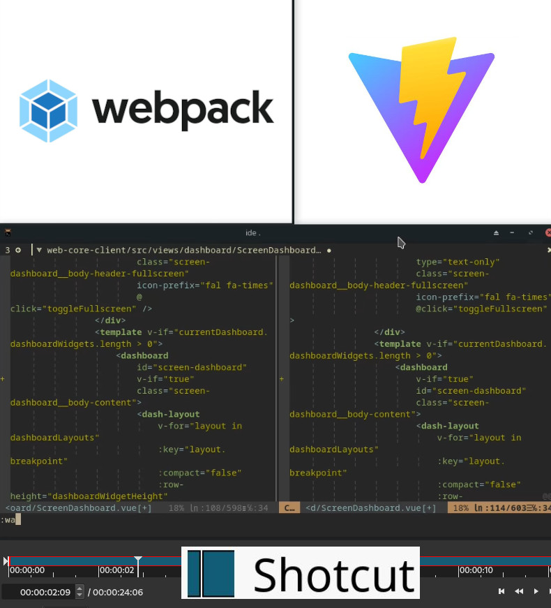

##
<!-- .slide: data-background-image="media/Porto-Vue-Evento.png" -->
---

## Vue2Vite 
<!-- .slide: data-background-image="media/background porto.vue.png" -->
A Developer Experience Sidequest ⚔️

**Tiago Pereira** <!-- .element: class="fragment fade-up" data-fragment-index="1" -->

<small>Front End developer @ Infraspeak</small> <!-- .element: class="fragment fade-up" data-fragment-index="2" -->
---

## First things first 
Show of hands 
<h1>🙌</h1> 

---

## Hands up if you are... 
* Using Vite in production <!-- .element: class="fragment" -->
  * With Vue2 <!-- .element: class="fragment" -->
  * With Vue3 <!-- .element: class="fragment" -->
  * With something else 👽<!-- .element: class="fragment" -->
---

## and what about... 
* Having migrated a Vue2 app to Vite?<!-- .element: class="fragment" -->
---

## Good! 

<big>moving on...</big> <!-- .element: class="fragment fade-up" -->

---
## The Problem

* Our app is built using Vue2
* That means it's built using webpack
* Which can become slow over time as complexity increases
* Really slow 🐌<!-- .element: class="fragment fade-up" -->

---
## The Problem in numbers

---
## `npm run serve`

```node
DONE  Compiled successfully in 90699ms

No type errors found
Version: typescript 4.0.5
Time: 33862ms
```

---
## `npm run serve`

* 90 seconds on average

* Would be fine if this happend once per day
  
Have breakfast <!-- .element: class="fragment fade-up" -->
  
Drop the kid at kindergarten <!-- .element: class="fragment fade-up" -->

`npm run serve` <!-- .element: class="fragment fade-up" -->

Right? <!-- .element: class="fragment fade-up" -->

---
## Wrong

* Let's be pedantic
* 2022 has got 229 working days
  * Maybe not as many, second kid is due this year 🍼
* Grand total of 5.725 hours wasted!
* That's almost a whole day's worth of work per year!

---
## Wronger still

Let's get real and execute a simple code change and watch the server reload

---
## Simple change I

```
DONE  Compiled successfully in 6503ms

Type checking in progress...
```

* 6 whole seconds
* But wait (no pun intented), it's still type checking!

---
## Simple change II

```
DONE  Compiled successfully in 6503ms

Type checking in progress...

  App running at:
  - Local:   secret localhost
  - Network: secret host 

No type errors found
Version: typescript 4.0.5
Time: 27550ms
```

* 27 seconds
* Waiting times are starting to compound
* I'm also being mean: the view does not wait for type checking to finish

---
## Time for some guesstimates

* 20 changes per hour
* 8 hours per day
* 6 seconds per change on average
* That adds up to 24 minutes waiting per day
* Remember those 229 working days?

---
## Waste

* That's almost 92 hours wasted per year
* Not so pedantic now

---
##


---
## It gets worse

* We use a containerized development enviroment
* That means node also runs inside a container
* Works fine for 99% of devs at Infraspeak
* Except for me and another poor soul
* Neither of us is using vanilla Ubuntu
  * He uses Mint
  * And I btw use Ar... Manjaro.
  * That's Arch Linux for dummies like me <!-- .element: class="fragment" -->

---
## Happy mode


---
## Berserk mode


---
## Not happy

* Need to restart the node container
* Which takes 90 seconds on average
* But now multiple times a day
* Math time again!

---
## Just kidding


<big>moving on...</big> <!-- .element: class="fragment fade-up" -->
---
## We want happy devs 

* This can mean different things to different peop... developers
* Its not one size fits all
* If anything shortening the loop between writing code and seeing it happen is good 

---
## Defining DX

> There is nothing more directly DX than the experience of typing code into code editing software and running it. That’s what “coding” is and that’s what developers do. It’s no wonder that developers take that experience seriously and are constantly trying to improve it for themselves and their teams.

[CSS Tricks on DX](https://css-tricks.com/what-is-developer-experience-dx/#aa-people-think-of-the-literal-experience-of-coding)

---
## We could 

* Split up the app into modules
* Give each dev a beefy workstation
* Use other tricks to speed things up

---
## Or maybe... 

* Vite is all the rage right?
* It's super fast and efficient
* Why not use it and ditch webpack?

---
## Great timing! 

Now I have something to present at PortoVue!


---
## But wait...

* Could we even use Vite?
* From what I had heard it was only for Vue3
* We didn't want to do that (not right now anyway)
  * ElementUI
  * Class based components (prob not a concern anymore)

---
## But how?

Let's see why Vite is so fast

<small>Cool digrams snatched from [vitejs.dev](https://vitejs.dev/guide/why.html#why-vite) and [esbuild.github.io](https://esbuild.github.io/)</small>

---
## Classic Bundlers


---
## ESM Bundlers


---
## Dependency Pre-Bundling  


notes:

* CommonJS and UMD compatibility: During development, Vite's dev serves all code as native ESM. Therefore, Vite must convert dependencies that are shipped as CommonJS or UMD into ESM first.
* Performance: Vite converts ESM dependencies with many internal modules into a single module to improve subsequent page load performance.

---
## Other tricks

* Route-based code splitting
* Native ESM on the browser
  * Efectively turning the browser into a bundler
  * dev server only
  * Bye bye IE (sorry not sorry)

---
## This felt possible


---
## 

<h2 class="r-fit-text">BUT WEIRD!</h2>

---
## Ready, set, Vite!

---
## Ask the internet first

* Surely there must be a _simple_ way of doing this
  * According to Daniel Kelly of Vue School there is: [How to Migrate from Vue CLI to Vite](https://vueschool.io/articles/vuejs-tutorials/how-to-migrate-from-vue-cli-to-vite/)
* Have guide, will follow! 🤓

---
## Update dependencies

```patch [5-11|19-21|29-30|34]
...
     "@types/zxcvbn": "4.4.0",
     "@typescript-eslint/eslint-plugin": "4.6.0",
     "@typescript-eslint/parser": "4.2.0",
-    "@vue/cli-plugin-babel": "^4.5.15",
-    "@vue/cli-plugin-eslint": "3.8.0",
-    "@vue/cli-plugin-pwa": "4.4.6",
-    "@vue/cli-plugin-typescript": "^4.5.15",
-    "@vue/cli-plugin-unit-jest": "^4.5.15",
-    "@vue/cli-service": "4.4.6",
+    "@vitejs/plugin-vue": "2.3.1",
     "@vue/eslint-config-standard": "5.1.2",
     "@vue/eslint-config-typescript": "7.0.0",
     "@vue/test-utils": "1.0.3",
...
     "postcss-cli": "9.1.0",
     "postcss-html": "1.3.0",
     "purgecss-webpack-plugin": "4.1.3",
-    "sass": "1.45.1",
-    "sass-loader": "10.1.1",
+    "sass": "1.50.1",
     "standard-version": "9.0.0",
     "storybook-addon-themes": "6.1.0",
     "stylelint": "14.1.0",
...
     "stylelint-scss": "4.0.1",
     "ts-jest": "26.4.3",
     "typescript": "4.0.5",
+    "vite": "2.9.5",
+    "vite-plugin-vue2": "1.9.3",
     "vue-cli-plugin-cordova": "2.4.1",
     "vue-loader": "15.9.3",
     "vue-template-compiler": "2.6.11",
+    "vue-tsc": "0.34.9",
     "webpack-bundle-analyzer": "4.5.0"
   },
   "peerDependencies": {
```

---
## Ignore old browsers

* Get rid of Babel
* Update `eslint` env from `node` to `es2021`

---
## Add vite.config.js

* Forget about `vue.config.js`
* Mapping is not straightforward
* This was a bit of trial and error
* And uh... reading the docs! 🙄

---
## Move index.html

* With Vite `index.html` lives in the root folder
* Replace any webpack configs with hardcoded values

---
## Update scripts

* Replace `vue-cli-service` commands with `vite` ones

---
## Update env vars

* `import.meta.env.` takes the place of `process.env.`
* `VUE_APP_` prefix must be updated to `VITE_`

---
## All done! Right?
> "Enjoy a Faster and More Seamless Development Experience"

Right?! <!-- .element: class="fragment fade-up" -->


---
## `npm run dev`

```
  vite v2.9.9 dev server running at:

  > Local: http://localhost:3000/
  > Network: use `--host` to expose

  ready in 832ms.
```

What? 832 miliseconds? 🫠

---
## Let's check the browser...


---
## Comment out the errors

🙈 🙉 🙊

---
## Let's check the browser... 


---
##


---
## 


---
## Let's see what `npm run build` says...

```
vite v2.9.9 building for production...
✓ 2 modules transformed.
dist/index.html                 9.38 KiB
dist/assets/index.f330a991.js   0.73 KiB / gzip: 0.41 KiB
```

* 1.570 seconds? 🔥
* 2 modules? 🤔

---
## That's too fast...

* Even for Vite
* Vite wasn't seeing the whole picture 
* `index.html` was using a `.js` loading script
* Swap the entry point with `src/main.ts`

---
## C'mon Vite... 

```
The following dependencies are imported but could not be resolved:

  element-ui/types/form (imported by ...)
  element-ui/types/message-box (imported by ...)
  element-ui/types/collapse (imported by ...)
  ...
  element-ui/types/upload (imported by ...)
  element-ui/types/button (imported by ...)
  element-ui/types/form-item (imported by ...)

Are they installed?
```

---
## What? 

```
10 |    async changeLanguage(language) {
11 |      const langCode = getLanguageConfiguration(language).elementUi;
12 |      await import(`element-ui/lib/locale/lang/${langCode}`).then((elementLang) => {
   |                   ^
13 |        elementLocale.use(elementLang.default);
14 |      });
The above dynamic import cannot be analyzed by vite.
```

---
## No no... 

```
16 |    async changeLanguage(language) {
17 |      const langCode = getLanguageConfiguration(language).moment;
18 |      await import(`moment/locale/${langCode}`).then(() => {
   |                   ^
19 |        moment.locale(langCode);
20 |      });
The above dynamic import cannot be analyzed by vite.
```

---
## Seriously? 

```
Undefined variable.
    ╷
225 │     --ids-light-background: #{$ids-light-background};
    │                               ^^^^^^^^^^^^^^^^^^^^^
    ╵
```

---
## Oh boy


Here we go... <!-- .element: class="fragment fade-up" -->

---
## So...

* Too many bugs 🦟
* Just comment the errors
* Fix them later YOLO

---
## Build it first

* Serve/fix loops would take forever
* A prod build should expose a decent amount of errors in one go
* Can also benchmark Vite builds against webpack

---
## Language files

* Add `.js` extension

---
## SASSy errors

* Comment all variable errors
* Will deal with this later
* Again... YOLO 😜

---
## Element UI

* CommonJS
* Hard dependency
* Only Element Plus supports Vue3

---
## Typescript type imports


---
## `import type`

* Fix all ElementUI type imports

```
PATTERN="(import)( \{.*\} from 'element-ui/types/.*'$)"
for f in $(rg -l "$PATTERN")
do rg "$PATTERN" --passthru -r '$1 type$2' $f | sponge $f
done
```

---
##


---
## That's it

* Everything seems ok
* Let's run a build

---
## Almost!


```
==== JS stack trace =========================================

FATAL ERROR: JavaScript heap out of memory
```

---
## Add more RAM


notes:

"build": "cross-env NODE_OPTIONS=--max-old-space-size=4096 vite build",

---
## Building

```
✓ 11492 modules transformed.
```

* 2:58 minutes? 🔥🔥🔥
* webpack takes 5:36
  * That's almost twice as fast: happier pipelines! 🪠
  * E.g.: First 6 months of 2020 totaled 255 pipeline hours that could be cut in half

---
## Check the browser...


---
##


---
##


---
##


---
##


---
## Quick explanation

* CORS is a mechanism that allows restricted resources to be requested from a domain other than the one where the first resource was served
* The browser was atempting an XHR request to api.infraspeak.development 
* But using a port the api was not expecting
* Thus the request is denied 💩

---
## Know what?

 <!-- .element: class="fragment" -->

---
## Fix the API

* This is a Vite demo
* I need this thing for the 25th
* Screw CORS
* YOLO <!-- .element: class="fragment" -->

---


```php
'allowed_origins' => ['*'],
```

---
## Check the browser?

 <!-- .element: class="fragment" -->


---
## 


---
## Let's click stuff

* Nothing happens... <!-- .element: class="fragment" -->

---
## Check DevTools


---
## 


---
## Ask the Internet why 


Uh... says who? 😒

---
## Oh... 


Ok, fine! 😤 <!-- .element: class="fragment" -->

---
## Vite CommonJS Plugin

```diff[8|14-18]
diff --git a/vite.config.js b/vite.config.js
index 7396c7914..0cf7e6944 100644
--- a/vite.config.js
+++ b/vite.config.js
@@ -1,11 +1,15 @@
 import { defineConfig } from 'vite'
 import { createVuePlugin as vue } from 'vite-plugin-vue2'
+import { viteCommonjs } from '@originjs/vite-plugin-commonjs'

 const path = require('path')

 // https://vitejs.dev/config/
 export default defineConfig({
-    plugins: [vue()],
+    plugins: [
+        vue(),
+        viteCommonjs()
+    ],
     resolve: {
```

notes:

* CommonJS vs ESM
* Vite does away with CommonJS (can be added via plugins) to target only modern browsers

---
##


* We're good now!

---
## Poking around

* Doesn't feel _that_ fast
  * That's because Vite builds on demand
  * Will require further tweaking
* Only slow when first visiting a view

notes:

* More and better routing
* Async Components https://vuejs.org/guide/essentials/component-basics.html#dynamic-components

---
## Did DX improve?

* Let's see how fast HMR is

---
## Simple benchmark

* We'll edit the same file over the same codebase
  * The original using webpack
  * The new and improved one using Vite
* Save both files at the same time
* Wait for HMR to kick in

---
## Simple benchmark


<video data-autoplay src="media/simple-benchmark.web"></video>

---


---

<div class="r-stack">
  
  
  
  
  
  
  
  
</div>

notes:

* A single frame after saving the files vite reloads the page (10fps)
* webpack takes almost 5 seconds to present the same change
* That's 50x faster. Efectively instantaneous

---

## Now THAT's fast

* A single frame after saving the files vite reloads the page (10fps)
* webpack takes almost 5 seconds to present the same change
* That's 50x faster. Efectively instantaneous! 🚀

---

## Know what else we could speed up?

---

<h2 class="r-fit-text">Storybook 🐌</h2> 

---
## Storybook with webpack


---
## Storybook with Vite


* 1.61 seconds vs 3.27 minutes 🔥 <!-- .element: class="fragment" -->

---
## Let's check our stories


---
## Something's not ri... 


---
##

<h2 class="r-fit-text">CTRL+C</h2>

---

<div class="r-stack">
  
  
  
</div>

---
## Maybe next time 🙄

* Storybook will consume all the RAM in the universe
* Let's speed something else up shall we?

---
## Nah, I'm done here!

* Hope you had a reasonable time
* Learning from someone else's mistakes is good
* But learning from your own is even better 🤓

<small>This presentation is available on [GitHub](https://github.com/tiagoafpereira/Vue2Vite-Presentation)</small>

---
## Up next 
<!-- .slide: data-background-image="media/background porto.vue.png" -->
**João Gonçalves** <!-- .element: class="fragment fade-up" data-fragment-index="1" -->

Someone who knows what he's doing! <!-- .element: class="fragment fade-up" data-fragment-index="2" -->

